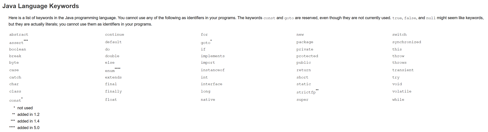
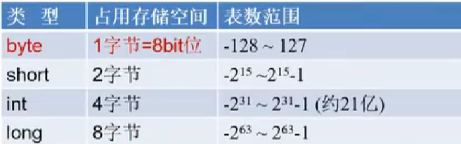
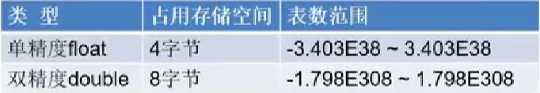
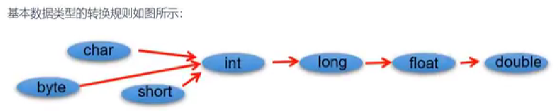

# JavaSE
## 一、Java语言概述
### 1、Java程序编写和执行的过程

- 步骤一：编写，将Java代码**编写**在.java结尾的源文件中
- 步骤二：编译：针对于.java结尾的源文件进行**编译**操作，生成一个或多个字节码文件。格式：javac 源文件名.java
- 步骤三：运行：针对编译后生成的字节码文件，进行解释**运行**。格式：java 字节码文件名

（注：一个源文件中可以声明多个类，但是最多只能有一个类使用public进行声明，且要求声明为public的类的类名与源文件名相同）

### 2、单行注释和多行注释

- 注释：源程序中用于解释、说明程序的文字就是注释。
  * 单行注释 //
  * 多行注释 /* */
  * (Java特有) 文档注释 /** */
    + 指令：javadoc -d 自取文件夹 -author -version 源文件名称.java

### 3、Java语言的优缺点

- 优点
    + 跨平台性：只要在需要运行Java应用程序的操作系统上，先安装一个Java虚拟机（JVM）即可。由JVM来负责Java程序在该系统中的运行。
    + 面向对象性：面向对象是一种程序设计技术，非常适合大型软件的设计和开发。面向对象编程支持封装、继承、多态等特性，让程序更好达到高内聚、低耦合的标准。
    + 健壮性：吸收了c/c++语言的优点，但去掉了其影响程旭健壮性的部分（如：指针、内存的申请与释放等），提供了一个相对安全的内存管理和访问机制。
    + 安全性高：Java适合于网络/分布式环境，需要提供一个安全机制以防恶意代码的攻击。如：安全防范机制，可以分配不同的命名空间以防替代本地的同名类、字节代码检查。
    + 简单性：Java就是c++语法的简化版，我们也可以将Java称之为“c++--”。比如：头文件、指针运算、结构、联合、操作符重载、虚基类等。
    + 高性能
- 缺点
    + 语法过于复杂、严谨。
    + 架构比较重。
    + 并非适合所有领域。

### 4、JVM功能说明

JVM：是一个虚拟计算机，是Java程序的运行环境。JVM具有指令集并使用不同的存储区域，负责执行指令，管理数据、内存、寄存器。
- 功能1：实现Java程序的跨平台性
- 功能2：自动内存管理（内存分配、内存回收）

## 二、变量与运算符

### 1、关键字

- 定义：被Java语言赋予了特殊含义，用做专门用途的字符串（或单词）
- 特点：小写字母

## 2、标识符
Java中变量、方法、类等要素命名时使用的字符序列，成为标识符。

- 命名规则
  * 由26个英文字母大小写，0-9，_或$组成
  * 数字不可以开头
  * 不可以使用关键字和保留字，但能包含关键字和保留字
  * Java中严格区分大小写，长度无限制
  * 标识符不能包含空格
- 命名规范
  * 包名：多单词组成时所有字母都小写：xxxyyyzzz
  * 变量名、方法名：多单词组成时，第一个单词首字母小写，第二个单词开始每个单词首字母大写：xxxYyyZzz
  * 类名、接口名：多单词组成时，所有单词的首字母大写：XxxYyyZzz
  * 常量名：所有字母都大写。多个单词时每个单词用下划线连接：XXX_YYY_ZZZ

## 3、变量
变量是程序中不可或缺的组成单位，最基本的存储单元。

- 变量的概念：
  * 内存中的一个存储区域，该区域的数据可以在同一类型范围内不断变化
  * 变量的构成包含三个要素：**数据类型、变量名、存储的值**
  * Java中变量声明的格式：**数据类型 变量名 = 变量值**
- 变量的作用：用于在内存中保存数据
- 使用变量注意：
  * Java中每个变量必须先声明、后使用
  * 使用变量名来访问这块区域的数据
  * 变量的作用域：其定义所在的一对{}内
  * 变量只有在其作用域内才有效，出了作用域，变量不可以再被调用
  * 同一个作用域内，不能定义重名的变量

## 4、计算机存储单位

- 字节：是计算机用于计算存储容量的基本单位，一个字节等于8bit
- 位：是数据存储的最小单位，二进制系统中，每个0或1就是一个位，叫做bit，其中8bit就称为一个字节。
- 转换关系：
  * 8bit = 1Byte
  * 1024Byte = 1KB
  * 1024KB = 1MB
  * 1024MB = 1GB
  * 1024GB = 1TB

## 5、Java中变量的数据类型

- 基本数据类型
  * 整型：byte、short、int、long

    + 定义long类型的变量，赋值时需要以“l”或“L”作为后缀
    + Java程序中变量通常声明为int型，除非不足以表示较大的值，才使用long
    + Java的整型常量默认为int型

  * 浮点型：float、double

    + 浮点型常量有两种表示形式：
      * 十进制形式。如：5.12  512.0f  .512(必须有小数点)
      * 科学计数法形式。如：5.12e2  512E2  100E-2
    + float:单精度，位数可以精确到7位有效数字。
    + double:双精度，精度是float的两倍。
    + 定义float类型的变量，赋值时需要以“f”或“F”作为后缀。
    + Java的浮点型常量默认为double型。
  
  * 字符型：char
- char型数据用来表示通常意义上“字符”（占2字节）
- Java中的所有字符都使用Unicode编码，故一个字符可以存储一个字母，一个汉字，或其他书面语的一个字符。
- 字符型变量的三种表现形式：
  * 形式1：使用单引号（''）括起来的单个字符
  * 形式2：直接使用Unicode值来表示字符型常量：'\uXXXX'，其中，XXXX代表一个十六进制整数。
  * 形式3：Java中还允许使用转义字符'\'来将其后的字符转变为特殊字符型常量。

  * 布尔型：boolean
- boolean类型用来判断逻辑条件，一般用于流程控制语句中：
  * if条件控制语句
  * while循环控制语句
  * for循环控制语句
  * do-while循环控制语句
- boolean类型数据只有两个值：true、false
  * 不可以使用0或非0的整数替代false和true

- 强制类型转换
  * 自动类型提升（将取值范围小或容量小的类型自动提升为取值范围大或容量大的类型）
  
  * 强制类型转换（将容量大的变量的类型转换为容量小的变量的类型），**强制类型转换需要使用强转符：()。在()内指明要转换为的数据类型。
  
- 引用数据类型
  * 类（class）
  * 数组（array）
  * 接口（interface）
  * 枚举（enum）
  * 注解（annotation）
  * 记录（record） 

